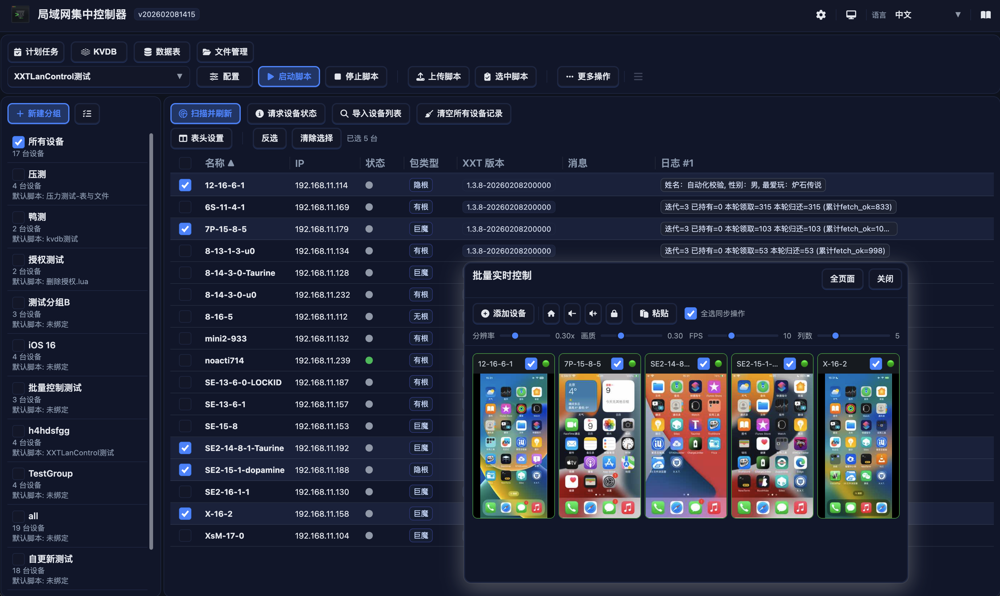

# XXTLanControl-Releases

`XXTLanControl-Releases` 是 **XXTLanControl** 的公开发布仓库。  
This repository is the public release channel for **XXTLanControl**.

本仓库用于发布各版本安装包、Docker 镜像归档与部署说明，不包含完整源码。  
It provides release binaries, Docker image archives, and deployment docs, but not the full source code.



## 下载地址 / Releases

- 下载地址列表 / Releases: [https://github.com/havonz/XXTLanControl-Releases/releases](https://github.com/havonz/XXTLanControl-Releases/releases)

## 版本与文件命名 / Versioning and Artifact Names

- 版本号格式 / Version format: `vYYYYMMDDHHMM` (例如 / e.g. `v202602080606`)
- 常见发布文件 / Common artifacts:
  - `XXTLanControl-macos-v*.zip`
  - `XXTLanControl-windows-v*.zip`
  - `XXTLanControl-Example-Win-v*.zip`
  - `XXTLanControl-linux-amd64-v*.zip`
  - `XXTLanControl-linux-arm64-v*.zip`
  - `XXTLanControl-docker-*-linux-amd64.tar`
  - `XXTLanControl-docker-*-linux-arm64.tar`

## 中文部署说明

### 1) 桌面/服务器安装包

#### Windows

1. 解压发行包到目标目录（例如 `D:\XXTLanControl`）。
2. 双击 `XXTLanControl-tray-windows-amd64.exe` 启动托盘程序。  
   如不使用托盘，可运行 `start-backend.cmd`。
3. 当系统托盘出现 XXTLanControl 图标时，表示托盘与后台服务已就绪。
4. 示例脚本可下载 `XXTLanControl-Example-Win-v*.zip`。

#### macOS

1. 解压后将 `XXTLanControl.app` 拖入 `Applications`。
2. 下载 [Sentinel](https://github.com/alienator88/Sentinel/releases/download/3.1.4/Sentinel.dmg)，打开后把 `XXTLanControl.app` 拖入 Sentinel 窗口的 "Allow unsigned app to launch" 区域，放行未签名应用。
3. 右键 `XXTLanControl.app` 选择“打开”。  
   若提示 “`XXTLanControl.app 已损坏，无法打开。您应该将它移到废纸篓`”，请先完成上一步。
4. 菜单栏出现 XXTLanControl 图标后，说明托盘与后台服务已启动。

#### Linux

1. 解压发行包并进入目录。
2. 运行：

   ```bash
   chmod +x start-backend.sh
   ./start-backend.sh
   ```

3. 脚本会根据主机架构自动选择 `XXTLanControl-backend-linux-amd64` 或 `...-arm64`。
4. 如需常驻运行，可接入 systemd/supervisor 等服务管理器。

### 2) Docker 部署

#### 2.1 在线拉取镜像（推荐）

同时发布至 Docker Hub 与 GHCR，均支持 `amd64`/`arm64` 多架构：

- Docker Hub: `havonz/xxtlancontrol`
- GHCR: `ghcr.io/havonz/xxtlancontrol`
- 标签：`latest`、`vYYYYMMDDHHMM`（例如 `v202602080606`）

示例（Docker Hub）：

```bash
docker pull havonz/xxtlancontrol:latest
docker run -d \
  --name xxtlancontrol \
  -p 46990:46990 \
  -p 31500:31500/udp \
  -v xxtlancontrol-data:/app/data \
  --restart unless-stopped \
  havonz/xxtlancontrol:latest
```

示例（GHCR）：

```bash
docker pull ghcr.io/havonz/xxtlancontrol:latest
docker run -d \
  --name xxtlancontrol \
  -p 46990:46990 \
  -p 31500:31500/udp \
  -v xxtlancontrol-data:/app/data \
  --restart unless-stopped \
  ghcr.io/havonz/xxtlancontrol:latest
```

#### 2.2 使用 `docker-compose.yml`（推荐）

仓库根目录提供 [docker-compose.yml](docker-compose.yml)：

```bash
docker compose up -d
```

默认镜像为 `ghcr.io/havonz/xxtlancontrol:latest`，默认使用 `host` 网络（Linux 推荐）。

切换镜像、标签、数据目录示例：

```bash
IMAGE=havonz/xxtlancontrol TAG=v202602080606 DATA_DIR_HOST=./xxtlancontrol-data docker compose up -d
```

#### 2.3 使用 `docker-compose-custom.yml`（桥接网络）

如果你需要显式端口映射，可使用 [docker-compose-custom.yml](docker-compose-custom.yml)：

```bash
docker compose -f docker-compose-custom.yml up -d
```

可选变量：
- `HTTP_PORT`（默认 `46990`）
- `UDP_LISTEN_PORT`（默认 `31500`）
- `ADVERTISE_API_URL`（桥接网络建议设置，例如 `http://192.168.1.100:46990`）

#### 2.4 离线部署（tar 包）

1. 下载对应架构 tar 包（`amd64` 或 `arm64`）。
2. 导入镜像：

   ```bash
   docker load -i XXTLanControl-docker-<buildtime>-linux-<arch>.tar
   ```

3. 按 `docker load` 输出的镜像名/标签运行容器即可。

### 3) 打开 Web 控制台

1. 托盘菜单选择“打开控制台”，或访问 `http://127.0.0.1:46990/`。
2. 界面默认简体中文，可通过右上角切换英文。
3. 若部署在局域网服务器，请改用服务器 IP，例如 `http://192.168.1.100:46990/`。

### 4) 升级说明

1. 先备份数据目录（Docker 默认挂载 `/app/data`）。
2. 停止旧版本服务或容器。
3. 拉取新镜像或下载新安装包。
4. 启动新版本并确认 `http://<host>:46990` 可访问。

### 5) 默认端口

- HTTP: `46990/tcp`
- 设备发现 UDP 监听: `31500/udp`

## Deployment Guide (English)

### 1) Desktop/Server Packages

#### Windows

1. Extract the release package to a target directory (for example `D:\XXTLanControl`).
2. Double-click `XXTLanControl-tray-windows-amd64.exe` to launch the tray app.  
   If you do not use the tray app, run `start-backend.cmd`.
3. When the XXTLanControl icon appears in the system tray, both tray and backend services are ready.
4. For sample scripts, download `XXTLanControl-Example-Win-v*.zip`.

#### macOS

1. Extract the package and drag `XXTLanControl.app` into `Applications`.
2. Download [Sentinel](https://github.com/alienator88/Sentinel/releases/download/3.1.4/Sentinel.dmg), then drag `XXTLanControl.app` into Sentinel to allow the unsigned app.
3. Right-click `XXTLanControl.app` and choose `Open`.  
   If you see “`XXTLanControl.app is damaged and can’t be opened. You should move it to the Trash`”, complete step 2 first.
4. Once the XXTLanControl icon appears in the menu bar, tray and backend services are running.

#### Linux

1. Extract the package and enter the directory.
2. Run:

   ```bash
   chmod +x start-backend.sh
   ./start-backend.sh
   ```

3. The script automatically selects `XXTLanControl-backend-linux-amd64` or `...-arm64` based on host architecture.
4. For persistent runtime, integrate with systemd/supervisor (or keep the shell session alive).

### 2) Docker Deployment

#### 2.1 Pull and Run (Recommended)

Images are published to both Docker Hub and GHCR with multi-arch support (`amd64`/`arm64`):

- Docker Hub: `havonz/xxtlancontrol`
- GHCR: `ghcr.io/havonz/xxtlancontrol`
- Tags: `latest`, `vYYYYMMDDHHMM` (for example `v202602080606`)

Example (Docker Hub):

```bash
docker pull havonz/xxtlancontrol:latest
docker run -d \
  --name xxtlancontrol \
  -p 46990:46990 \
  -p 31500:31500/udp \
  -v xxtlancontrol-data:/app/data \
  --restart unless-stopped \
  havonz/xxtlancontrol:latest
```

Example (GHCR):

```bash
docker pull ghcr.io/havonz/xxtlancontrol:latest
docker run -d \
  --name xxtlancontrol \
  -p 46990:46990 \
  -p 31500:31500/udp \
  -v xxtlancontrol-data:/app/data \
  --restart unless-stopped \
  ghcr.io/havonz/xxtlancontrol:latest
```

#### 2.2 Use `docker-compose.yml` (Recommended)

This repository includes [docker-compose.yml](docker-compose.yml):

```bash
docker compose up -d
```

Default image: `ghcr.io/havonz/xxtlancontrol:latest`.  
The default compose file uses `host` networking (recommended on Linux).

Switch image/tag/data path:

```bash
IMAGE=havonz/xxtlancontrol TAG=v202602080606 DATA_DIR_HOST=./xxtlancontrol-data docker compose up -d
```

#### 2.3 Use `docker-compose-custom.yml` (Bridge Networking)

Use [docker-compose-custom.yml](docker-compose-custom.yml) when you need explicit port mapping:

```bash
docker compose -f docker-compose-custom.yml up -d
```

Optional variables:
- `HTTP_PORT` (default `46990`)
- `UDP_LISTEN_PORT` (default `31500`)
- `ADVERTISE_API_URL` (recommended in bridge mode, e.g. `http://192.168.1.100:46990`)

#### 2.4 Offline Deployment (tar archive)

1. Download the tar archive matching your architecture (`amd64` or `arm64`).
2. Load image:

   ```bash
   docker load -i XXTLanControl-docker-<buildtime>-linux-<arch>.tar
   ```

3. Run container with the image/tag printed by `docker load`.

### 3) Open the Web Console

1. Choose “Open Console” from tray menu, or visit `http://127.0.0.1:46990/`.
2. The UI defaults to Simplified Chinese; switch to English via the top-right language toggle.
3. For LAN deployment, use the server IP, e.g. `http://192.168.1.100:46990/`.

### 4) Upgrade

1. Backup data directory first (`/app/data` in Docker by default).
2. Stop old service/container.
3. Pull the new image or download the new package.
4. Start new version and verify `http://<host>:46990`.

### 5) Default Ports

- HTTP: `46990/tcp`
- Device discovery UDP listen: `31500/udp`

## 反馈与问题 / Feedback and Issues

- Issues: [https://github.com/havonz/XXTLanControl-Releases/issues](https://github.com/havonz/XXTLanControl-Releases/issues)
